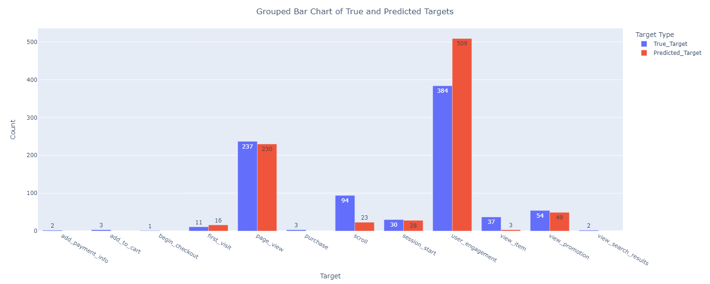
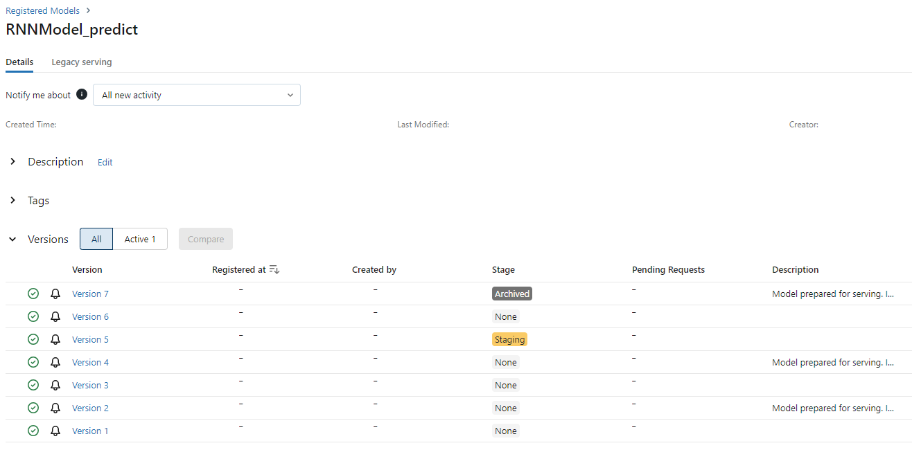

# Readme for Customer Analysis Project

## Introduction
This project utilizes an RNN model and a Transformer model, both built with the PyTorch library. The models are designed to predict the next event from a sequence of events that may occur during a single user session. It is also possible to predict user churn based on the user's most recent sequence of events, which may be significantly longer than the sequence of events that occur during one session.

## Table of Contents
- [Data Source and Definition of Churn](#data-source-and-definition-of-churn)
- [Data preparation and Splitting](#data-preparation-and-splitting)
- [Model Configuration and Pipeline](#model-configuration-and-pipeline)
- [Training Process and Parameter Selection](#training-process-and-parameter-selection)
- [Attention Mechanisms and Visualization](#attention-mechanisms-and-visualization)
- [Configuring MLFlow and Model Parameters](#configuring-mlflow-and-model-parameters)
- [Installation](#installation)
- [Code Structure and Unit Tests](#code-structure-and-unit-tests)
- [Example Notebooks](#example-notebooks)
- [Possible Business Use Cases](#possible-business-use-cases)

## Data Source and Definition of Churn
For the purpose of this project, data from BigQuery [GA4] has been used. The data spans two days, with 100k records each day.\
The definition of churn is based on engagement timestamps. If a user performs any action 24 hours after their first engagement, they are considered as not churned. Otherwise, the user is considered as churned. Also, if a user’s last engagement is within the first 10 minutes from their first engagement, they are considered as bounced. Bounced users are excluded from the churned users to filter out users who have never been really active. Later on, all events are collected chronologically for each user as input sequence data for prediction. The definition of churn is based on the example taken from:\
*https://github.com/GoogleCloudPlatform/analytics-componentized-patterns/blob/master/gaming/propensity-model/bqml/bqml_ga4_gaming_propensity_to_churn.ipynb* \
The prediction of the next event is based on sequences of events that occurred during a single user session.

## Data preparation and Splitting
The data is split into training, validation, and test sets in the proportions of 70%, 15%, and 15% respectively, and preprocessed to create TensorDatasets for each split. The preparation of the TensorDataset varies depending on the prediction task - whether it is prepared for next event prediction or churn prediction, and also which model will be used for training, validation and testing.

## Model Configuration and Pipeline
The two models are running within their respective pipelines. The pipelines reqires string path to *config.json* file, padding value and number of classes for classification in RNN or the number of expected features in the input for Transformer model.\
The *config.json* files for the models are locaded in 'config/nn' folder. Each .json consists of groups of parameters, eg. "*model_init_params*", "*model_training_params*", "*grid_search_params*" and "*mlflow_config*".

## Training Process and Parameter Selection
The training of the models is conducted in batches and is compatible with both 'cpu' and 'cuda' devices. The training process utilizes a grid-search mechanism to select the best parameters. Regularization and early stopping mechanisms have also been implemented.

## Attention Mechanisms and Visualization
Both models employ attention mechanisms. For the RNN model, it is possible to use "global", "self", and "multi-head" attention mechanisms. Note, that the "multi-head" mechanism is a "self" attention used by each head. For the Transformer model, the "multi-head" attention mechanism is used, based on the PyTorch implementation. In order to gain access to the attention weights, the nn.TransformerEncoderLayer and nn.TransformerEncoder has been extracted from the PyTorch library and slightly modified to gain access to attention weights. This allows the visualization of the attention weights, which can be displayed as a heatmap. This heatmap visualizes the attention given to an event in a sequence. One heatmap plot is produced for a batch of sequences.
\
Below there are shown a bar plot received for predicting the next event from a sequence of events and the attention heatmap for the task. Both plots are based on RNN prediction data, which achaived 69.6% of prediction accuracy on the test data.\
\
\
For churn prediction task, plots are shown below. Both plots are based on RNN prediction data, which achaived 94% of prediction accuracy on the test data.\
\

## Configuring MLFlow and Model Parameters
In the *config.json* file, you can activate the use of MLFlow for logging model parameters and metrics during the training or prediction phase. To activate MLFlow, set "enable" to true. It is also possible to use a local server for logging and specify its port. If "use_local_server" is set to true, then the local server will be set up for the training/validation phase and also for prediction, and will be turned off afterwards. You can turn on the local server again by using the command "*mlflow ui --port 5000*" in the terminal or other specified port. MLFlow UI allows to view recorded experiments and registered models as it is shown on below pictures.
\
\
\
In the *config.json* file, you can also specify the path for saving PyTorch artifacts, set up an "*early_stopping_patience*", or decide whether to return churn probability with the "*return_churn_prob*" parameter. It is also possible to specify the grid search metric from one of the following options: ["accuracy", "precision", "recall", "f1"]. This determines which metric will be used to consider one model as the best among others with different hyperparameter setups during the grid-search phase. Please note, that not all parameters have been mentioned here, in the readme file.

## Installation
To use this library, named "customer_analysis", simply use the "*pip install -e .*" command in the directory of this project or install the prebuilt Python wheel located in the "dist" folder of this project.
The project requirements are specified in the "install_requires" section of the setup.cfg file.

## Code Structure and Unit Tests
The general code is located in the "src" folder. Unit tests for the models can be found in the "tests" folder. The data files with user events are located in the "data" folder.

## Example Notebooks
Finally, example notebooks are located in the "examples" folder. There are four example notebooks. For the RNN model, there is a notebook that shows an example of next event prediction and one notebook for churn prediction. The other two notebooks show similar usage examples but with the Transformer model.

## Possible Business Use Cases
The “customer_analysis” library, can be utilized in various business scenarios:

- **Customer Retention:** By predicting user churn, businesses can proactively reach out to customers who are likely to churn and take measures to retain them. This could involve offering special discounts, personalized recommendations, or improving the customer experience based on the sequence of events leading to churn.

- **Personalized Marketing:** The next event prediction feature can help businesses understand the customer journey and anticipate their needs. This can be used to deliver personalized marketing messages or product recommendations at the right time.

- **Product Development:** By understanding the sequence of events in a user session, businesses can gain insights into how their product or service is being used. This can guide product development efforts and help businesses prioritize features or areas that need improvement.

- **Sales Forecasting:** The churn prediction feature can also be used to forecast future sales and revenue. By understanding the rate at which customers churn, businesses can make more accurate sales forecasts.
